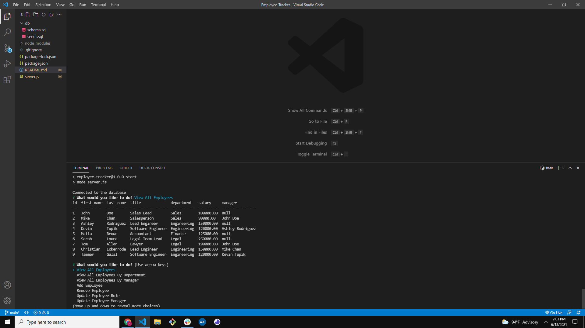

# Employee-Tracker

## Description
Ccommand-line application that lets an organization track their employees.
  ***
  ## Table of Contents
  [Installation](#installation),[Usage](#usage),[Credits](#credits),[License](#license)
  ***
  ## Installation
  Mysql then, the node inquirer needs to be installed.
  ***
  ## Usage
  https://github.com/mainmaster84/Employee-Tracker
  https://drive.google.com/file/d/1nstYvppP8szOn0OsxSEC7XDpmbpOv5Bi/view
  
  ***
  ## Credits
  Ronald Main
  ***
  ## License
  MIT
  ***
  ## Badges
  None
  ***
  ## Features
  None
  ***
  ## Contributing
  None
  ***
  ## Tests
  None